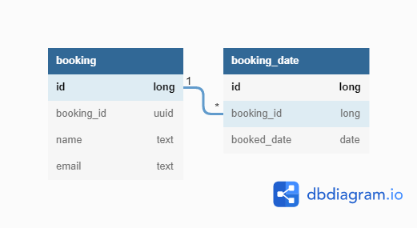

## Book the campsite
---
## Requirements highlights

### CRUD operations
 * User should be able to book the campsite, update the booking or delete the booking.
 * User should be able to query the availability of campsite.
 * When booking a site, the earliest start date is the next day.
 * When booking a site, the max end date is one month after the current day.
 * The booking can be 1 day, 2 days or 3 days.

### HTTP REST
Provide REST API for the CRUD operations

### Workload
The system should be able to handle concurrent requests, especially the create/update operations.

---
## Design

### REST API endpoints
When run the project on the workstation, use this link to get more details about the endpoints: `http://<host>:<port>/webjars/swagger-ui/index.html`
- **GET** example: 
  ```
  http://<host>:<port>/booking/api/v1/availability/?start=2022-06-03&end=2022-06-30
  ```
  On the server side, The start date will be set to tomorrow if it's earlier than tomorrow. The end date will be set to one month later from the current day if it's more advanced.

- **POST** example: 
  ```
  http://<host>:<port>/booking/api/v1/book
  ```
  This post request requires a JSON body as following:
  ```
  {
    "name": "Full Name",
    "email": "email@gmail.com",
    "start": "2022-06-05",
    "end": "2022-06-06"
    }
  ```
  A booking ID in UUID format will be returned, the booking ID can be used to update or cancel the booking.

- **PATCH** example: 
  ```
  http://<host>:<port>/booking/api/v1/update/{id}
  ```
  The `id` is the booking id(UUID) of the booking. This patch requires a JSON body as following:
  ```
  {
    "name": "John Doe",
    "email": "email@gmail.com",
    "start": "2022-06-05",
    "end": "2022-06-06"
  }
  ```
  All the fields are optional: if a field is not provided in the request body, it will not be updated.
  The booking ID will be returned upon successful update.

- **DELETE** example: 
  ```
  http://<host>:<port>/booking/api/v1/cancel/{id}
  ```
  The `id` is the booking id(UUID). The booking ID will be returned upon successful cancellation.

### Design highlights

* Use Spring Boot, Spring reactive stack: webflux and Spring R2DBC with postgres. 
  The reactive stack can support more concurrent requests. 
  Although R2DBC does not support relationship well, the application code takes care of it.

* As a development environment setup, start postgres docker container as following:
  ```
  docker run -d --name postgres -v postgres_data:<local_location> -e POSTGRES_USER=camp -e POSTGRES_PASSWORD=camp123 -p 5432:5432 postgres:latest
  ```
  Then start the web application by `gradle bootRun`, or start the `BookingApplication` in your IDE. 

* The codes are organized by packages represent various concepts of a REST backend development:
  - dto: various DTO objects used by communication between client and server side
  - controller: REST controllers for url routing
  - service: the services used by controllers. 
  - entity: Objects mapping to the DB tables
  - repos: the DB respsitories to support various db operations
  - exception: Webflux way of exception handling

* There are two tables in the DB: booking and booking_date:
  

  The relationship between these tables are one-to-many: for each booking, there will be one record in the booking table, and multiple records in the booking_date table for the booking, each of them represent a single day within the booking. 
  
  This makes the query of campsite availability very fast, there is no need to calculate on the date ranges of existing bookings. 
  
  When a booking is deleted, all it's booking_date records are deleted.

* Leverage Postgres DB transaction management to support concurrent create/update/delete operations.
  The `booking_date_booked_date` unique constrain makes sure all bookings are not overlapping with each other.

* The REST requests are validated using Spring validation. 
  If request data are not well formatted, 400(Bad Request) status
  code will be returned. 
  There are also business logic validation on the request, for example, booking duration should not be longer than 3 days. 
  With both validations, the input data are checked before passing to the persistent layer.

* When things go wrong(date validation error, or server side error, etc.), the application will return http status code 4xx and 5xx without any details by default. If the request has request parameter `message=true`, a message attribute that further explains the failure will be returned. At the same time, the exception and its stacktrace will be in the log file, thanks
to the code in the `exception` package.

* [Flyway](https://flywaydb.org/) is used to support future db schema upgrade.

* This project exposes endpoint details using [Springdoc-openapi](https://springdoc.org/). When the application is running, more details about the REST api is available by the link `http://<host>:<port>/webjars/swagger-ui/index.html`.

* This project leverages `WebFluxTest` to test code in the `controller` and `service` package by mocking on the database repositories.

* Integration tests are provided in `IntegrationTests.java`, [TestContainer](Testcontainershttps://www.testcontainers.org) is used to bring up a progres docker for the test.

* A special integration test `concurrentBookingTest()` is provided to test concurrent bookings mentioned in the requirement. It repeat folloing test three times(could be even more times):

  >Three booking requests with overlapping booking days are sent to the server at the same time(each request runs in its own thread) by using Webflux `WebClient`, then verify that only one of the bookings is successful. Cancel the successful booking at the end.

## Further Improvement
- Define service specific metrics, use Spring Acurator to monitor the service in production env. 
- Better supports on deployments.
